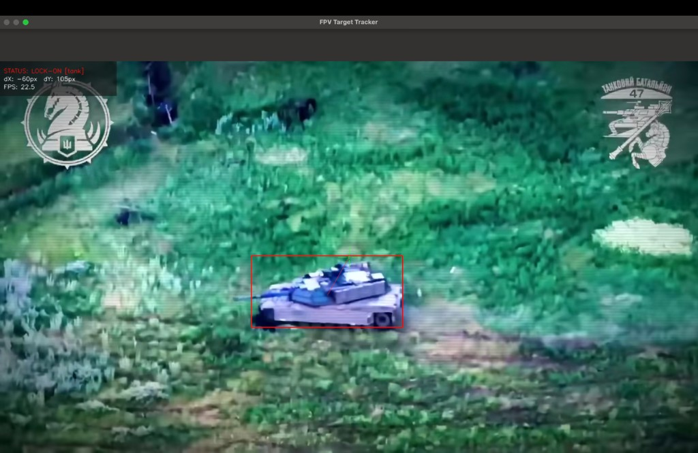
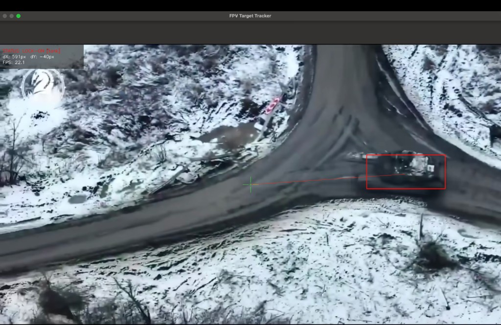
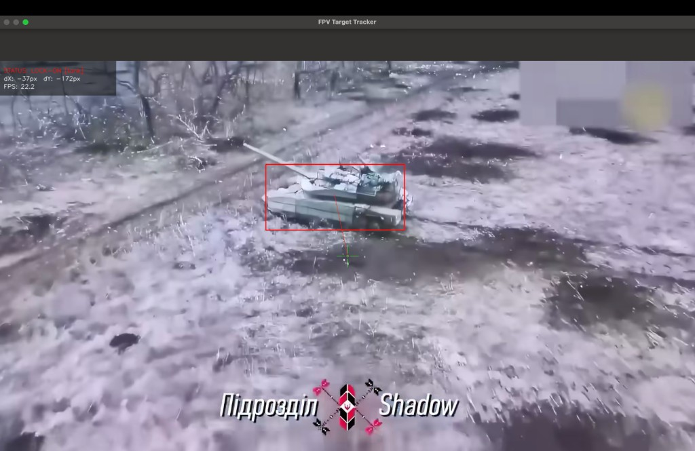

# Autonomous Target Tracking & Reconnaissance System (ATTRS)

An advanced computer vision pipeline built for real-time military hardware detection, object tracking, and tactical HUD/OSD visualization. The system combines deep learning-based object detection with classical computer vision algorithms to achieve low-latency performance on edge-computing devices.

## Screenshots

Real-time tank lock-on with military OSD on FPV drone footage (~22 FPS on Apple Silicon):

| Field engagement | Aerial reconnaissance | Winter terrain |
| :---: | :---: | :---: |
|  |  |  |

---

## Key Features

* **Multi-Class Detection:** Fine-tuned YOLOv8 model specialized in identifying armored vehicles (`Tank`) and personnel (`Soldier`) in diverse operational environments (urban, rural, concealed).
* **Temporal Tracking Persistence:** Implemented a target-lock preservation algorithm that prevents target switching and handles brief occlusions (smoke, debris, foliage) with a configurable "Lost Tracking" frame timeout.
* **Jitter Elimination:** Integrated coordinate smoothing using an Exponential Moving Average (EMA) filter to ensure stable crosshair placement during dynamic camera movements.
* **Dynamic Military OSD/HUD:** A high-performance OpenCV-based overlay featuring real-time status indication (`[ SEARCHING ]` / `[ TARGET LOCKED ]`), distance/pixel delta calculations (dX, dY), and flashing lock-on alerts.
* **Hardware Acceleration:** Native optimization for Apple Silicon utilizing the **Metal Performance Shaders (MPS)** backend for real-time inference.

---

## Model Performance & Metrics

The detection core was fine-tuned via transfer learning on custom-curated datasets containing 2,000+ labeled frames.

| Target Class | mAP50 | Precision | Recall |
| :--- | :--- | :--- | :--- |
| **Tank** | 0.884 | 0.818 | 0.854 |
| **Soldier** | 0.695 | 0.804 | 0.610 |
| **Combined** | **0.789** | **0.853** | **0.714** |

*Inference Speed:* ~12-16ms per frame on Apple M2 (MPS execution loop).

---

## Installation

```bash
cd fpv-targeting-system
python3 -m venv .venv
source .venv/bin/activate
pip install -r requirements.txt
```

Place your trained weights at `models/best.pt` (not tracked in git).

## Usage

### Webcam

```bash
python3 main.py
```

### Video file

```bash
python3 main.py --source videos/test_kota.mp4 --model models/best.pt
```

### Export annotated video

```bash
python3 main.py --source videos/test_kota.mp4 --model models/best.pt --export videos/output.mp4
```

Press **q** to quit.

---

## Tech Stack

* **Core AI:** PyTorch, Ultralytics YOLOv8
* **Computer Vision:** OpenCV (Python)
* **Performance Tuning:** Apple MPS / CoreML compilation ready
* **Environment:** Python 3.10+, Virtualenv

---

## Architecture & Logic Flow

1. **Inference Stream:** `main.py` initializes the video capture stream and feeds frames sequentially to `src/detector.py`.
2. **Confidence Filtering:** Detections below the configured threshold are discarded to minimize false positives caused by environmental clutter.
3. **Tracking Engine:** Once a target is selected, its bounding box centroid is prioritized across frames. If tracking is lost, coordinates freeze for several frames before resetting.
4. **UI Hydration:** `src/ui.py` renders the telemetry grid and crosshairs, converting raw coordinate data into actionable pixel deltas.

## Project Structure

```
fpv-targeting-system/
├── main.py           # Main loop, CLI
├── train.py          # YOLO fine-tuning
├── requirements.txt
├── models/           # best.pt (gitignored)
├── videos/           # Test videos (gitignored)
└── src/
    ├── detector.py   # Tank detection + tracking
    └── ui.py         # Military OSD rendering
```
